# ASUS Z490M-PLUS Hackintosh (Dual Boot) - OpenCore 0.6.4
MacOS Catalina 10.15.7 | Windows 10 20H2
-----------------------|----------------
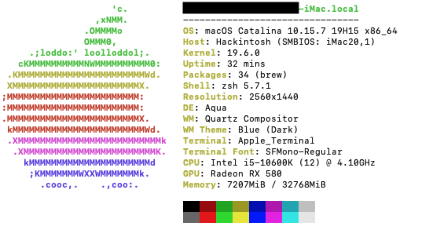 | 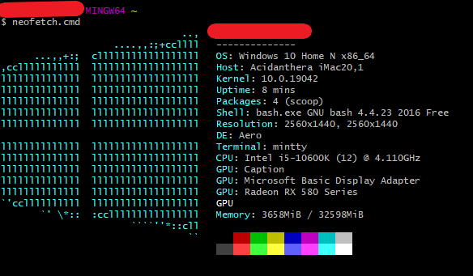 

## 1.  Background Story
This repository will hopefully help others who are looking make a hackintosh, especially if they are using the same hardware. AFAIK, everything works just like it would on a real Mac. 

The reason for going on this journey to get a dual boot hackintosh began when my 2010 MBP's 2nd motherboard finally threw the towel in a couple of years ago. Since then, I originally thought about buying a new iMac or new MBP but they are both way too expensive, in my country anyway. I then settled with using a Windows desktop but I found it annoying for anything other than work stuff (MS Office etc.), and it was incredibly slow. Whilst dealing with my first-world problem, I researched Clover on the tonymac forums, and while there were some great builds and success stories, I wanted a reliable and ***almost*** identical machine to a Mac. Fast-forward and here we are, with Opencore 0.6...; I decided to heavily research compatible hardware, which would work with my budget (see Hardware, below).

Even with countless reads of the [Open Core Install Guide](https://dortania.github.io/OpenCore-Install-Guide/), scrolling through Reddit [r/hackintosh](https://www.reddit.com/r/hackintosh/) and following along in the [Discord](https://discord.com) channel (/r/Hackintosh Paradise), I still found ways to make, what should be a straight forward process, painstakingly long. I seemed to be able to make an errors at various points. I will share those to help others, so they don't make the same errors and hopefully save a lot of time and frustation. 

## 2. Specs
### Hardware
* Motherboard: ASUS Z490M-PLUS (Realtek® ALC887)
* CPU: Intel i5 10600K
* GPU: Sapphire RX 580 Pulse 8GB Lite
* CPU Cooler: Deepcool Gammaxx C40
* RAM: Corsair Vengance LPX 32GB (2x 16GB) 3200GHz
* NVMe: Samsung 970 EVO 500GB (MacOS)
* NVMe: Samsung 970 EVO 500GB (Win10)
* PSU: Corsair RM550x
* Case: Thermaltake S100 TG mATX - Snow Edition
* WiFi/BT: Fenvi T1919 (MacOS)
* WiFi: Netgear A6210 (Windows)
* Keyboard: Logitech K235
* Mouse: Logitech M170
* Monitor: BenQ PD2700Q

### Drivers
* AudioDxe.efi (post-install)
* HfsPlus.efi
* OpenCanopy.efi (post-install)
* OpenRuntime.efi

### Kexts
* AppleALC.kext
* IntelMausiEthernet.kext
* Lilu.kext
* NVMeFix.kext
* SMCProcessor.kext
* SMCSuperIO.kext
* VirtualSMC.kext
* WhateverGreen.kext

### SDDTs
* SDDT-AWAC.aml
* SDDT-EC.aml
* SDDT-PLUG.aml
* SDDT-USB-Reset.aml
* SDDT-USBX.aml

### SMBIOS
iMac 20,1

### To do:
* Boot chime
* USB Mapping
* Change from DEBUG to RELEASE

### What is working
Everything that I have tested so far. This includes: 
* Audio
* Bluetooth
* Opencore Bootloader
* Sidecar
* WiFi (Fenvi on macOS and Netgear on W10)
* USB outlets

### What isn't working
Nothing that I have found.

## Tests
### Geekbench 5 (CPU): macOS vs Win10
macOS | Win10
----- |------
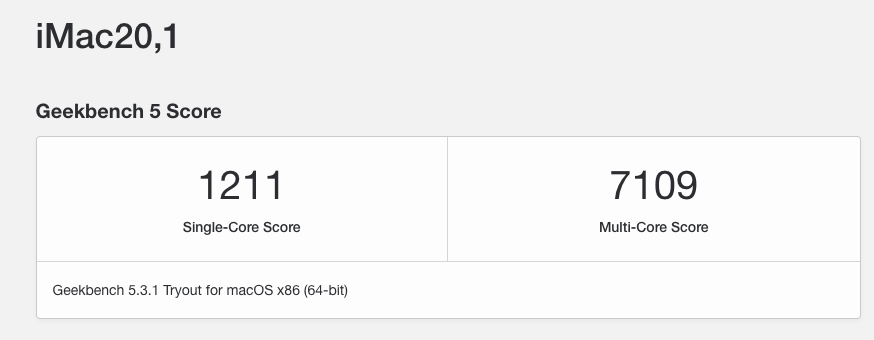 | 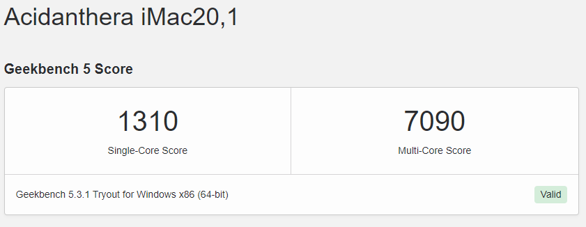

### Geekbench 5 (GPU): macOS vs Win10
macOS | Win10
----- |------
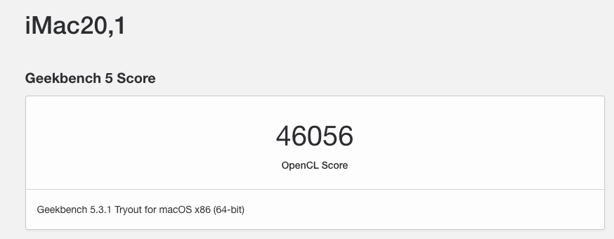 | 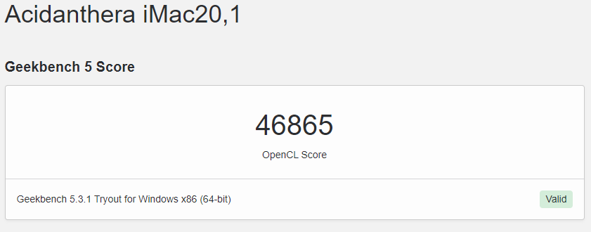

### NVMe Speed Test: macOS vs Win10 (_not the same testing software!_)
macOS | Win10
----- |------
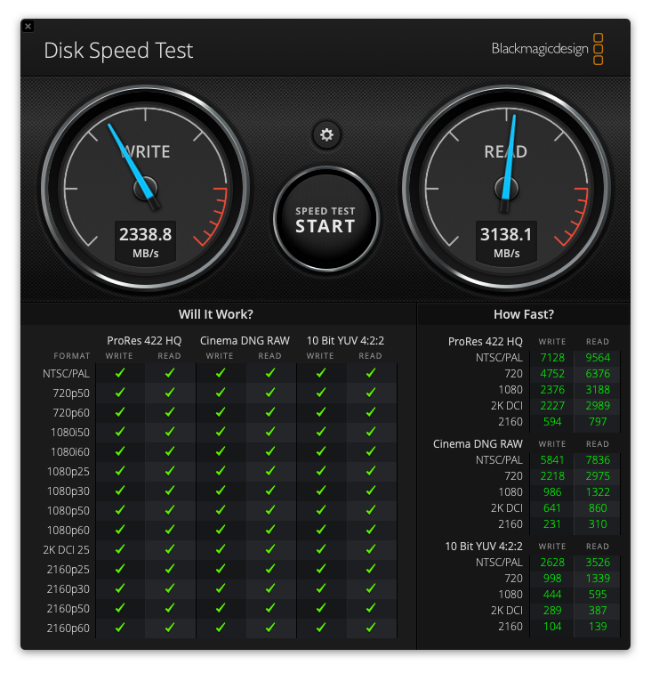 | 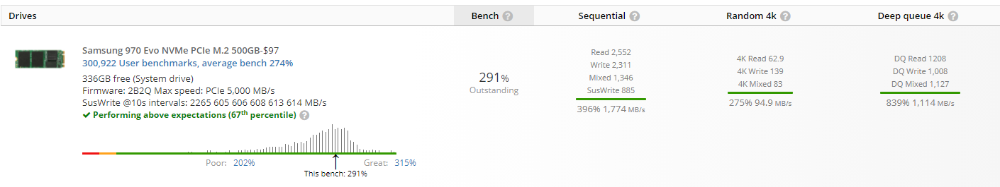

### WiFi Speed Test: Fenvi 1919 vs Netgear A6210
macOS | Win10
----- |------
 |  

## 3. The Build
Exterior | Inside | Window | Complete Setup
-------- | ------ | ------ | --------------
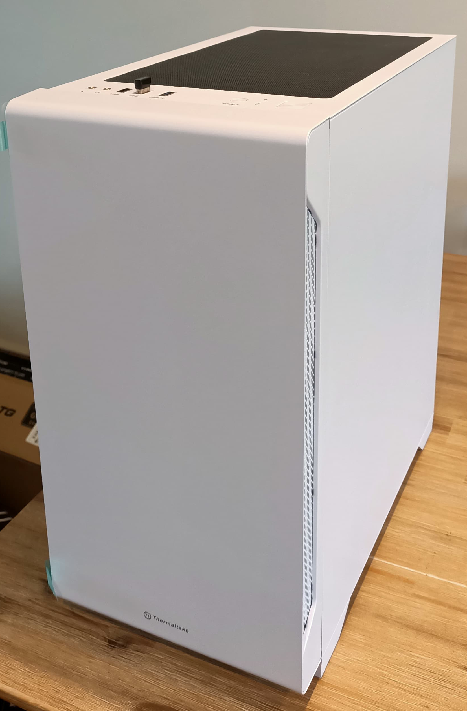 | 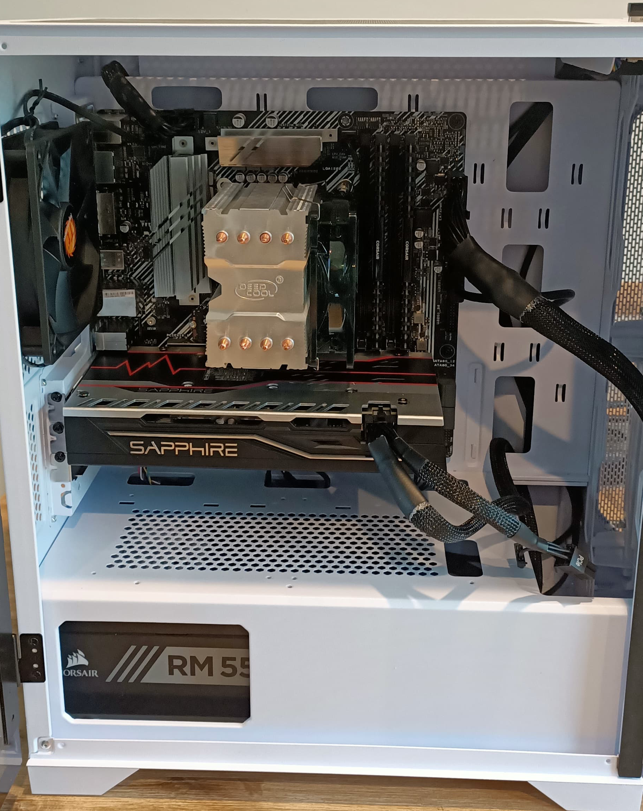 | 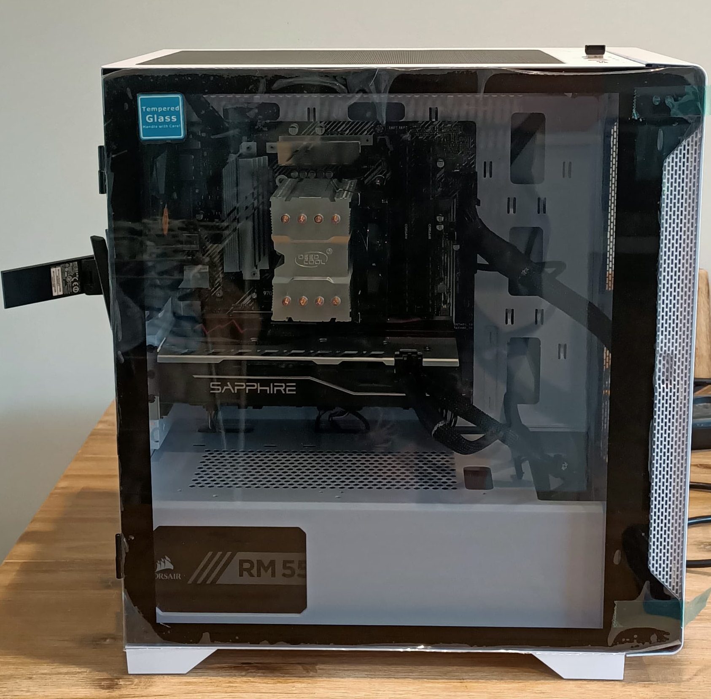 | 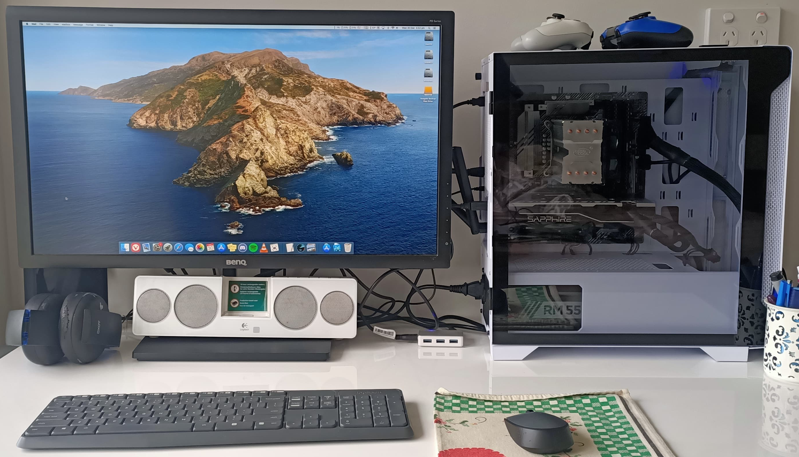

There isn't a whole lot to be gained from my building skills! It was mostly straight forward, with the help of this [video](https://www.youtube.com/watch?v=v7MYOpFONCU) by Linus Tech Tips. The two biggest pains for me were: 
1. attaching the CPU cooler; The screws weren't sitting correctly in the bracket to attach to the underside of the motherboard. This meant that the screws coming through to the main side of the motherboard were too short; luckily I didn't do any damage (very close to bending the board with too much force though!).   
2. Attaching the I/O plate to the case and getting it to line up with the monitor. 

I should add, a m-ATX build in this case is super easy! Some people will probably think the case is too big though. As a n00b, I think I would have struggled with a smaller case. The size and design of the case meant cable management (especially with a modular PSU) was easy and playing around with components is pretty accessible. I'm not into RGB but I'm sure if you are into it, this case would work well. I intially thought that I might need to buy some extra fans, but from the testing that I have done, it doesn't seem necessary. I haven't done any CPU/GPU OC'ing though.

## 4. Windows Installation
Because my MBP (2010) is no longer fuctioning, I was left with a Windows PC to download the files that I needed. The reason for installing Windows first was to troubleshoot any potential issues with the build. I also took the opportunity to update the bios and create the USB needed to install OpenCore bootloader and macOS on the target machine. Before that, how I created the Windows USB (to install Windows).

On my old Windows Desktop, I followed this [guide](https://www.howtogeek.com/427223/how-to-download-a-windows-10-iso-without-the-media-creation-tool/) to download the Windows 10 ISO. I then followed this [guide](https://www.howtogeek.com/howto/9585/how-to-setup-a-usb-flash-drive-to-install-windows-7/) (from Step 2). Once the USB was created I then turned on my new computer with the USB and one of the NVMes connected . Booting straight to bios, I turned on XMP to OC my RAM and had a look around in the bios. Making sure the USB was the first boot priority, I left the bios and was greeted with the Windows Installer. I selected Windows 10 Home N (I don't recommend this, as it leaves out the h.264 codec).

To be continued.
