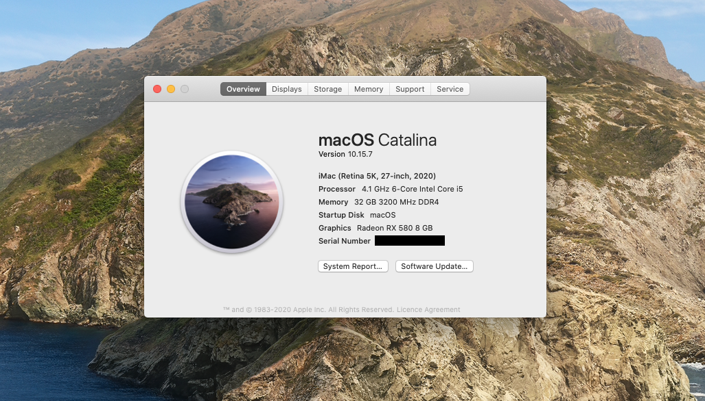

# ASUS Z490M-PLUS Hackintosh (Dual Boot)
## Opencore 0.6.4 - MacOS Catalina 10.15.7 / Windows 10 (W10)

## Background Story
This repository will hopefully help others who are looking make a hackintosh, especially if they are using the same hardware as mine. AFAIK, everything works just like it would on a real Mac. 

The reason for going on this journey to get a dual boot hackintosh began when my 2010 MBP's 2nd motherboard finally threw the towel in a couple of years ago. Since then, I originally thought about buying a new iMac or new MBP but they are both way too expensive, in my country anyway. I then settled with using a Windows desktop but I found it annoying for anything other than work stuff (MS Office etc.), and it was incredibly slow. Whilst dealing with my first-world problem, I researched Clover on the tonymac forums, and while there were some great builds and success stories, I wanted a reliable and identical machine to a Mac. Fast-forward and here we are, with Opencore 0.6...; I decided to heavily research compatible hardware, which would work with my budget (see Hardware, below).

Even with countless reads of the [Open Core Install Guide](https://dortania.github.io/OpenCore-Install-Guide/), scrolling through Reddit [r/hackintosh](https://www.reddit.com/r/hackintosh/) and following along in the [Discord](https://discord.com) (/r/Hackintosh Paradise), I still found ways to make it straight forward process, painstakingly long. I seemed to be able to make an error at various points. I will share those to help others, so they don't make the same errors and hopefully save a lot of time and frustation. 

### Hardware
* Motherboard: ASUS Z490M-PLUS
* CPU: Intel i5 10600K
* GPU: Sapphire RX 580 Pulse 8GB Lite
* CPU Cooler: Deepcool Gammaxx C40
* RAM: Corsair Vengance LPX 32GB (2x 16GB) 3200GHz
* NVMe: Samsung 970 EVO 500GB (MacOS)
* NVMe: Samsung 970 EVO 500GB (Windows)
* PSU: Corsair RM550x
* Case: Thermaltake S100 TG mATX - Snow Edition
* WiFi/BT: Fenvi T1919 (MacOS)
* WiFi: Netgear A6210 (Windows)
* Keyboard: Logitech K235
* Mouse: Logitech M170
* Monitor: BenQ PD2700Q

### Drivers
* AudioDxe.efi (post-install)
* HfsPlus.efi
* OpenCanopy.efi (post-install)
* OpenRuntime.efi

### Kexts
* AppleALC.kext
* IntelMausiEthernet.kext
* Lilu.kext
* NVMeFix.kext
* SMCProcessor.kext
* SMCSuperIO.kext
* VirtualSMC.kext
* WhateverGreen.kext

### SDDTs
* SDDT-AWAC.aml
* SDDT-EC.aml
* SDDT-PLUG.aml
* SDDT-USB-Reset.aml
* SDDT-USBX.aml

### SMBIOS
iMac 20,1

### To do:
* Boot chime
* Bootcamp
* USB Mapping
* Change from DEBUG to RELEASE

### What is working
Everything that I have tested so far. This includes: 
* Audio
* Bluetooth
* Opencore Bootloader
* Sidecar
* WiFi (Fenvi on macOS and Netgear on W10)
* USB outlets

### What isn't working
Nothing that I have found.

To be continued.
